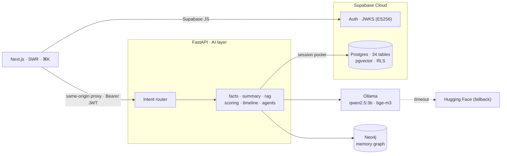

<div align="center">


<br/>


</div>

---

## 📌 Project Title

**Pulse — Customer Intelligence Agent**

An AI assistant that turns scattered CRM, ticket, billing and usage data into decisions.
Ask *"Give me a summary of this customer"* or *"Why is this customer at risk?"* and get a
grounded, explainable answer with citations — plus a full **Customer 360**: AI summary,
explainable risk, chronological timeline, RAG chat, multi-agent briefs and a memory-graph.

---

## 👥 Team Members

- **Tarun J**
- **Subhasri K**
- **Satish Kumar**

---

## 🎯 Problem Statement

Customer-facing teams (Support, Sales, Customer Success) waste time stitching together a
customer's story from many disconnected systems before they can act. Pulse solves this by
generating a **summarized, explainable view of any customer** — activity patterns, issues
and complaints, key insights, and churn risk — from structured data + LLMs, and lets users
**ask natural-language follow-ups** with conversational memory and cited evidence.

**What it delivers**
- Accept a query like *"Give me a summary of this customer."*
- Produce a concise summary: **activity patterns · issues/complaints · key insights · recommendations.**
- Present it clearly, with confidence and source citations.
- Bonus (implemented): follow-up Q&A (*"Why is this customer at risk?"*), explainable risk
  scoring, a 360 timeline, multi-agent meeting briefs, and a relationship **memory graph**.

---

## 🧰 Technologies Used

| Layer | Technology |
|---|---|
| **Frontend** | Next.js 14 (App Router), TypeScript, Tailwind CSS, SWR, Recharts, lucide-react |
| **Design system** | "Classical" editorial — Cormorant Garamond + Lora, warm palette, gold accent |
| **Authentication** | Supabase Auth (asymmetric **ES256** JWT, verified via JWKS) + RLS + audit logs |
| **Database** | Supabase **PostgreSQL 17** — single source of truth, 34 tables |
| **Vector search** | **pgvector** (1024-dim, cosine) inside Supabase |
| **Backend / AI** | **FastAPI** (Python 3.11), SQLAlchemy 2.0 |
| **LLM runtime** | **Ollama** — `qwen2.5:3b` (generation) · `bge-m3` (embeddings) |
| **Model routing** | **LiteLLM** → Hugging Face Inference fallback on local timeout/error |
| **Graph database** | **Neo4j 5** (customer memory graph) |
| **Performance** | in-memory TTL cache · DB indexes · SWR client cache · same-origin API proxy |
| **Deployment** | **Docker Compose** |

**Model notes** — chosen for a fully local, offline demo that still reasons well:

| Model | Role | Params | Context |
|---|---|:--:|:--:|
| Qwen2.5-3B-Instruct | summaries · chat · agents | 3.1B | 32K |
| BGE-M3 | embeddings (RAG) | 568M | 8192 |
| Qwen2.5-7B-Instruct | cloud fallback (HF) | 7.6B | 128K |

---

## 🗂️ Folder Structure

```
CB-PROJ/
├─ docker-compose.yml          # frontend · backend · ollama · neo4j
├─ .env.example                # environment template (copy to .env)
├─ README.md · DESIGN.md · LICENSE
├─ docs/
│  └─ banner.svg               # animated README banner
├─ supabase/
│  ├─ config.toml
│  └─ migrations/              # 34 tables · pgvector · RLS · performance indexes
├─ backend/                    # FastAPI AI service
│  ├─ Dockerfile · pyproject.toml
│  └─ app/
│     ├─ main.py               # app entry + router mounts
│     ├─ core/                 # config · db · security(JWKS) · cache · audit
│     ├─ models/               # SQLAlchemy models (7 modules)
│     ├─ schemas/              # Pydantic request/response
│     ├─ services/             # facts · llm · rag · summary · scoring · timeline · graph · agents
│     ├─ api/routers/          # customers · summary · chat · risk · timeline · agents · graph · alerts · analytics · admin · ingest
│     └─ seed/                 # synthetic data generator
└─ frontend/                   # Next.js app
   ├─ Dockerfile · next.config.mjs · tailwind.config.ts
   └─ src/
      ├─ app/(app)/            # dashboard · customers/[id] · analytics · alerts · admin
      ├─ app/login/            # Supabase auth
      ├─ components/           # Sidebar · Topbar · CommandBar · 360 tabs · charts
      └─ lib/                  # SWR hooks · api client · supabase
```

---

## 🚀 How to Run

**Prerequisites:** Docker Desktop, a hosted Supabase project, ~4 GB disk for the models.

```bash
# 1. Configure environment
cp .env.example .env
#    Fill in Supabase keys + the SESSION-POOLER DATABASE_URL (IPv4, +psycopg driver,
#    URL-encode special chars in the password).

# 2. Apply the database schema
#    Supabase SQL editor: paste supabase/all_migrations.sql
#    (or: supabase db push)

# 3. Start all services
docker compose up -d --build
docker compose exec ollama ollama pull qwen2.5:3b
docker compose exec ollama ollama pull bge-m3

# 4. Seed synthetic data (customers, tickets, orders, embeddings, graph, auth users)
docker compose exec backend python -m app.seed.run
```

| Surface | URL | Credentials |
|---|---|---|
| **App** | http://localhost:3000 | `ava@calispec.ai` / `Passw0rd!demo` |
| **API docs** | http://localhost:8000/docs | — |
| **Neo4j** | http://localhost:7474 | `neo4j` / *(your NEO4J_PASSWORD)* |

> ⚠️ Supabase's *direct* DB host is IPv6-only and unreachable from Docker on Windows.
> Use the **Session Pooler** connection string (IPv4) in `DATABASE_URL`.

### Architecture



---

## 📊 Current Progress

**Status: complete PoC — running end-to-end and deployed.**

| Capability | Status |
|---|:--:|
| Data model (34 tables, pgvector, RLS) + synthetic seed | ✅ |
| AI Summary (activity · issues · insights · recommendations) | ✅ |
| Conversational RAG assistant (citations, intent routing) | ✅ |
| Explainable risk (health/churn + SHAP-style factors) | ✅ |
| Customer 360 timeline | ✅ |
| Multi-agent meeting brief (support · sales · finance + planner) | ✅ |
| Memory-graph search (Neo4j) | ✅ |
| Analytics · Alerts · Admin/RBAC pages | ✅ |
| Auth (Supabase ES256/JWKS) + RLS + audit | ✅ |
| "Classical" editorial UI + ⌘K command bar | ✅ |
| Performance: caching · indexes · same-origin proxy | ✅ |

**Indicative latency** (local, CPU-only): data APIs ~0.3–0.6 s · risk < 50 ms · timeline ~40 ms ·
RAG chat / summary ~20–40 s (CPU LLM-bound) · multi-agent brief ~1–2 min.

---

## 🔮 Future Work

- **Live data connectors** — CRM / Zendesk / Stripe behind the ingestion interface (replacing synthetic seed).
- **Autonomous action workflows** — refund / approval / escalation with human-in-the-loop.
- **Scheduled alerts + notification channels** — email / Slack / in-app delivery.
- **Reporting** — report generation and export (PDF / CSV).
- **GPU inference profile + streaming responses** — 5–20× faster LLM latency.
- **Model upgrades** — Qwen2.5-7B/14B for higher-quality summaries and reasoning.

<div align="center"><sub>Pulse — Customer Intelligence Agent · MIT License</sub></div>
