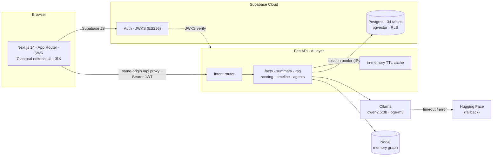
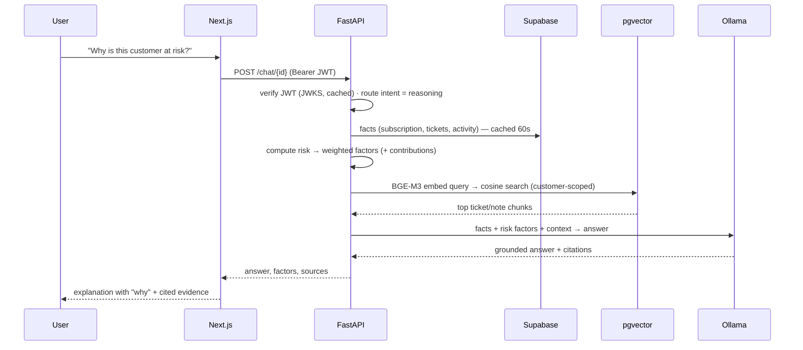

<div align="center">



<br/>

<!-- badges -->


<h3><em>Turn scattered CRM, ticket, billing &amp; usage data into decisions.</em></h3>

<p>Ask <b>"Give me a summary of this customer"</b> or <b>"Why is this customer at risk?"</b> — and get a grounded, explainable answer with citations.</p>

</div>

---

## ✨ What it does

A **Customer 360** assistant for customer-facing teams. Pick a customer and instantly get:

| | Capability | Powered by |
|:--:|---|---|
| 📝 | **AI Summary** — Activity · Issues · Insights · Recommendations, with confidence + citations | Local LLM + RAG |
| 💬 | **Conversational assistant** — follow-ups, citations, intent-routed | RAG over pgvector |
| ⚠️ | **Explainable risk** — health/churn score with **SHAP-style** factor bars ("why") | Transparent weighted model |
| 🕒 | **Customer 360 timeline** — unified chronological event feed | Cross-table aggregation |
| 🧑‍💼 | **Multi-agent meeting brief** — Support · Sales · Finance specialists → Planner | LLM agents |
| 🕸️ | **Memory-graph search** — *"who is complaining about the API?"* | Neo4j (Cypher) |
| 📊 | **Analytics** — segment/lifecycle charts, top at-risk by MRR | Cached aggregates + Recharts |
| 🔔 | **Alerts** — churn-risk inbox + one-click evaluation | Scoring engine |
| 🔐 | **Auth + RBAC + audit** — Supabase Auth (ES256/JWKS), RLS, roles/permissions | Supabase + FastAPI |
| ⌘ | **Command bar (⌘K)** + dark-free **editorial UI** | Next.js |

---

## 🏗️ Architecture



**Runtime split:** Supabase owns data / auth / storage / vectors; FastAPI owns all AI work. The browser talks to the backend **same-origin** through a Next.js rewrite proxy (one warm keep-alive connection), which reaches FastAPI over the fast Docker network.

---

## 🔁 Example flow — *"Why is this customer at risk?"*



---

## 🧰 Tech stack

| Layer | Technology |
|---|---|
| **Frontend** | Next.js 14 (App Router), TypeScript, Tailwind, SWR, Recharts, lucide-react |
| **Design** | "Classical" editorial system — Cormorant Garamond + Lora, warm palette, gold accent |
| **Auth** | Supabase Auth — asymmetric **ES256** JWT, verified via JWKS (HS256 fallback) |
| **Database** | Supabase **PostgreSQL 17** — single source of truth, 34 tables, RLS |
| **Vectors** | **pgvector** (1024-dim, cosine) in Supabase |
| **Backend** | **FastAPI** (Python 3.11), SQLAlchemy 2.0 |
| **LLM runtime** | **Ollama** — `qwen2.5:3b` (chat) · `bge-m3` (embeddings) |
| **Routing / fallback** | **LiteLLM** → Hugging Face Inference on local timeout/error |
| **Graph** | **Neo4j 5** (memory graph) |
| **Perf** | in-memory TTL cache · 58 DB indexes · SWR client cache · same-origin API proxy |
| **Deploy** | **Docker Compose** |

---

## 📈 Model benchmarks

Models chosen for a **fully local, offline** demo that still reasons well.

| Model | Role | Params | Context | Notes |
|---|---|:--:|:--:|---|
| **Qwen2.5-3B-Instruct** | summaries · chat · agents | 3.1B | 32K | strong quality/latency balance on CPU |
| **BGE-M3** | embeddings (RAG) | 568M | 8192 | multilingual, 1024-dim, hybrid retrieval |
| **Qwen2.5-7B-Instruct** | cloud fallback (HF) | 7.6B | 128K | only on local timeout/error |

**Measured operation latency** — local, **CPU-only**, Supabase in `ap-northeast-1` *(indicative)*:

| Operation | Latency | Bound by |
|---|:--:|---|
| Data API (customers / analytics), warm cache | **~0.3–0.6 s** | network to Supabase (Tokyo) |
| Risk scoring (health/churn + factors) | **< 50 ms** | pure Python |
| Timeline (cached) | **~40 ms** | in-memory cache |
| RAG chat answer | **~15–35 s** | CPU LLM generation |
| AI summary (4 sections) | **~20–40 s** | CPU LLM generation |
| Multi-agent brief (4 LLM calls) | **~60–120 s** | CPU LLM generation |

> 💡 LLM latency is CPU-bound. On a GPU (or via the HF fallback) these drop by 5–20×. Data APIs are cached and the browser uses one warm keep-alive connection to avoid Docker Desktop's per-connection overhead on Windows.

---

## 🚀 Quick start

**Prerequisites:** Docker Desktop, a hosted Supabase project, ~4 GB disk for models.

```bash
# 1. Configure
cp .env.example .env         # fill Supabase keys + SESSION-POOLER DATABASE_URL

# 2. Apply the schema (Supabase SQL editor: paste supabase/all_migrations.sql,
#    or use the Supabase CLI: supabase db push)

# 3. Start everything
docker compose up -d --build
docker compose exec ollama ollama pull qwen2.5:3b
docker compose exec ollama ollama pull bge-m3

# 4. Seed synthetic data (25 customers, tickets, orders, embeddings, graph, auth users)
docker compose exec backend python -m app.seed.run
```

| Surface | URL | Credentials |
|---|---|---|
| **App** | http://localhost:3000 | `ava@calispec.ai` / `Passw0rd!demo` |
| **API docs** | http://localhost:8000/docs | — |
| **Neo4j** | http://localhost:7474 | `neo4j` / *(your NEO4J_PASSWORD)* |

> ⚠️ Supabase's *direct* DB host is IPv6-only; Docker containers on Windows can't reach it. Use the **Session Pooler** connection string (IPv4) in `DATABASE_URL`, with the `postgresql+psycopg://` driver and a URL-encoded password.

---

## 🗂️ Project structure

```
CB-PROJ/
├─ docker-compose.yml          # frontend · backend · ollama · neo4j
├─ supabase/migrations/        # 34 tables · pgvector · RLS · perf indexes
├─ backend/app/
│  ├─ models/                  # SQLAlchemy (7 modules)
│  ├─ services/                # facts · llm · rag · summary · scoring · timeline · graph · agents
│  ├─ api/routers/             # customers · summary · chat · risk · timeline · agents · graph · alerts · analytics · admin
│  └─ seed/                    # synthetic data generator
└─ frontend/src/
   ├─ app/(app)/               # dashboard · customers/[id] · analytics · alerts · admin
   ├─ components/              # Sidebar · Topbar · CommandBar · 360 tabs · charts
   └─ lib/                     # SWR hooks · api client · supabase
```

See **[DESIGN.md](DESIGN.md)** for the full spec and the feature → endpoint traceability matrix.

---

## 🎨 Design system

The UI follows a **"Classical" editorial** language: warm off-white canvas, gold/bronze accent,
Cormorant Garamond headings + Lora body, hairline dividers, pill chips and underlined tabs —
a calm, print-inspired look that keeps dense customer data readable.

---

## 🛣️ Roadmap

- Live connectors (CRM / Zendesk / Stripe) behind the ingestion interface
- Autonomous action workflows (refund / approval / escalation)
- Scheduled alert delivery + notification channels
- Report generation & export
- GPU inference profile + streaming responses

<div align="center"><sub>Built as a Customer Intelligence PoC · MIT License</sub></div>
