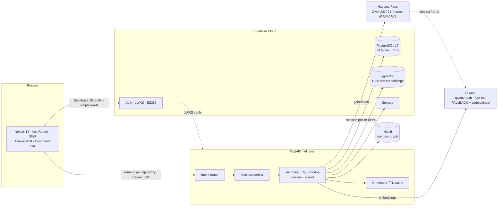
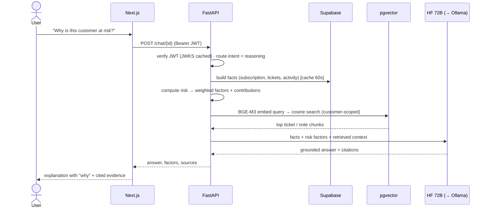
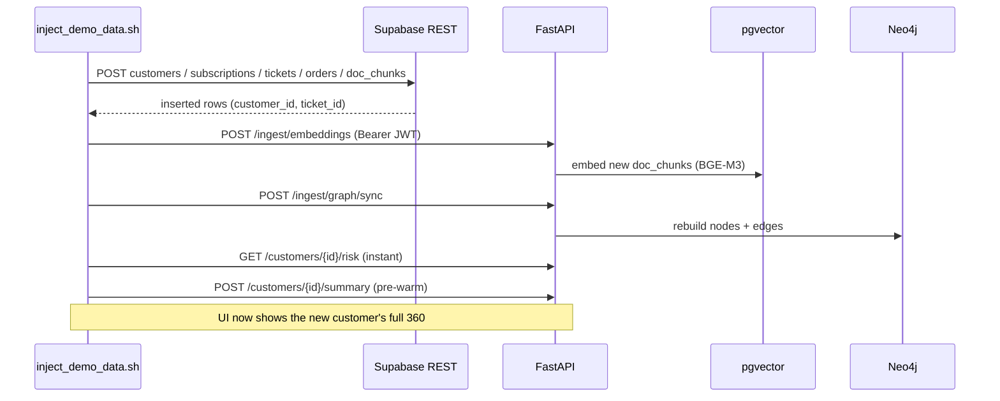
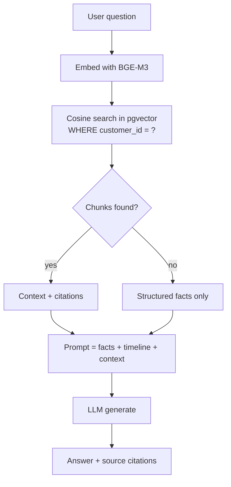
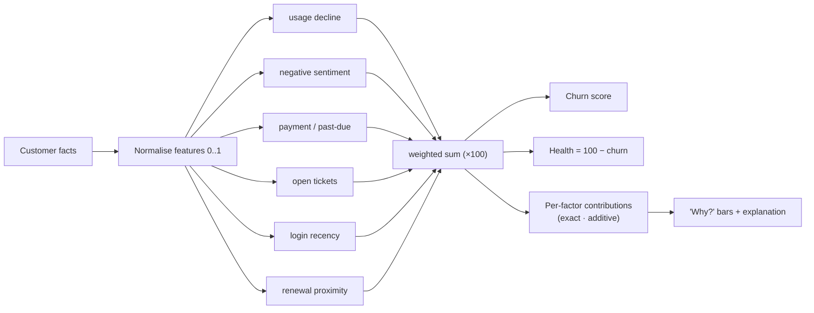
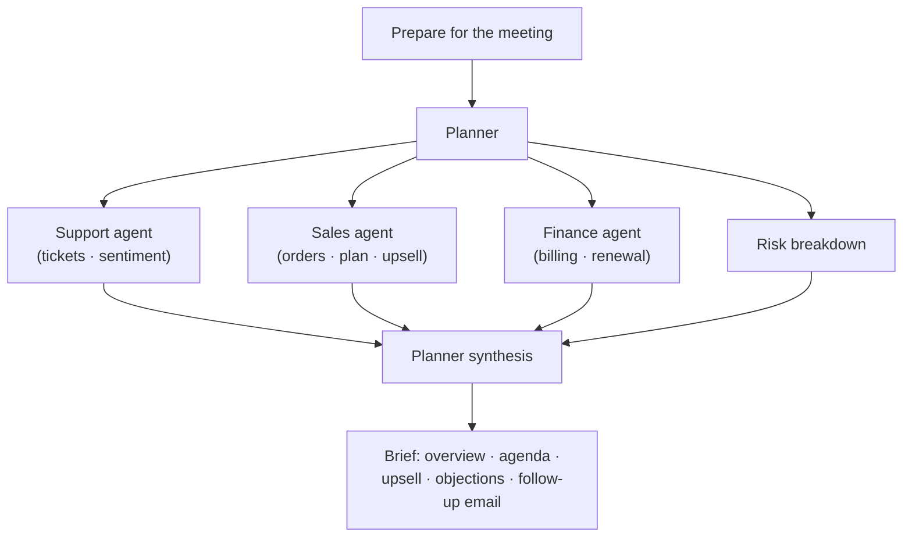
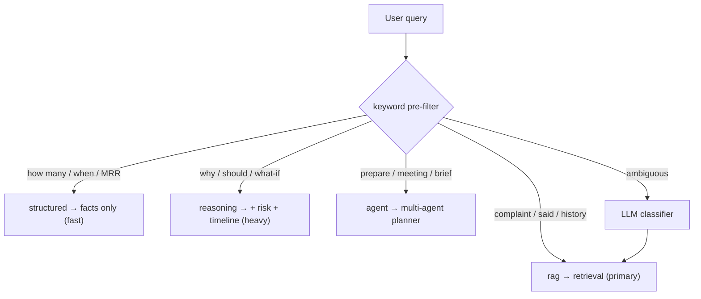
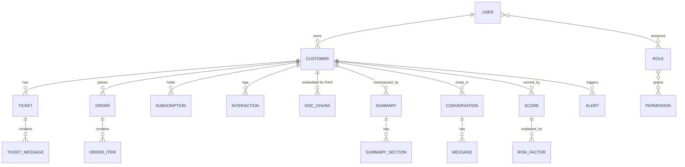
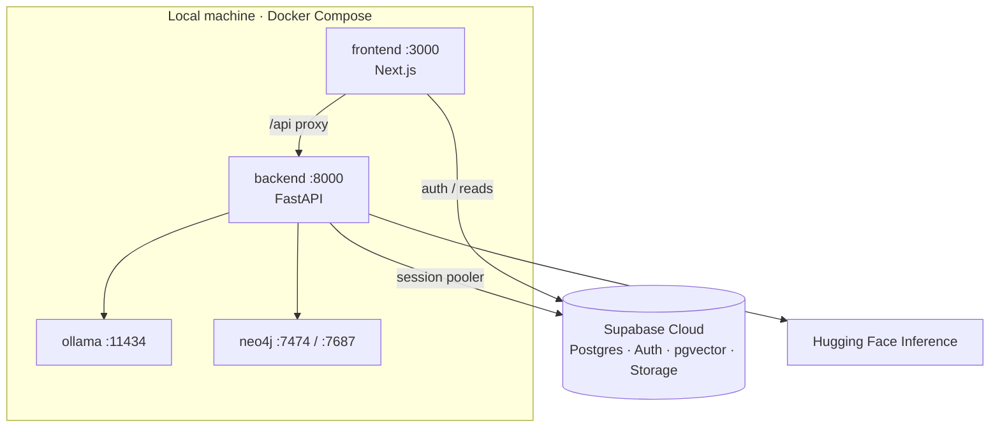

# Pulse — Architecture Diagrams (Mermaid)

Paste any block into a Markdown file on GitHub, [mermaid.live](https://mermaid.live),
or slides that support Mermaid.

---

## 1. System architecture

---

## 2. Request sequence — "Why is this customer at risk?"

---

## 3. Live demo — inject data via API

---

## 4. RAG retrieval pipeline

---

## 5. Explainable risk scoring

---

## 6. Multi-agent meeting brief

---

## 7. Intent routing

---

## 8. Data model (7 modules)

---

## 9. Deployment (Docker Compose + Supabase Cloud)

